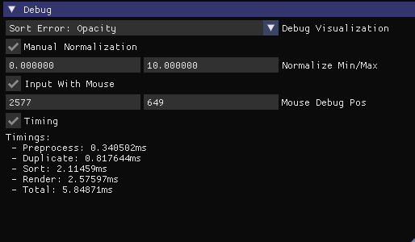

# StopThePop - SIBR

This builds onto the **SIBR** viewer, and adds functionalities for interactive usage of the [StopThePop Hierarchical Rasterizer](https://github.com/r4dl/StopThePop-Rasterization), which is downloaded at build-time.

The `gaussianviewer` checks for a `config.json` file in the model root directory, and sets the GUI fields accordingly. It defaults to Vanilla 3DGS if no config exists.

We also added multiple additional debug view modes:

* **Sort Error: Opacity Weighted**: Accumulated opacity values of consecutive out-of-order Gaussians (in render).
* **Sort Error: Distance Weighted**: Accumulated difference in distance to the camera of consecutive out-of-order Gaussians (in render).
* **Gaussian Count Per Tile**: Number of Gaussians, registered to each tile (shows the effect of culling).
* **Gaussian Count Per Pixel**: Number of Gaussians evaluated during rendering of each pixel (shows additionally the effect of hierarchical 4x4 culling).
* **Depth**: Global Depth
* **Transmittance**: Accumulated transmittance per pixel.

## Additional Debug Functionalities



For a better debugging experience, we added two extra functionalities:
- Debug Normalization
- Statistics and Mouse Input
- Timings

### Debug Normalization
By default, the output values for debugging modes are normalized to lie within [0,1] and are subsequently output as either a **Magma** or a **Turbo** Colormap.
We allow for manual normalization by ticking the checkbox ```Manual Normalization```.

### Statistics and Mouse Input
For each frame, we output detailed statistics for all values, which look like the following (here, we show the results for the ```Depth``` Debug View):
``` shell
[SIBR] --  INFOS  --:	Depth for pixel (1900, -55): value=0, min=0.527305, max=32.5155, avg=3.9126, std=3.21768
```

To obtain the exact value for each pixel, tick ```Input With Mouse```, where you can specify the pixel with manual input or with the mouse.

### Timings

By ticking ```Timings```, we output detailed timings for each stage of the 3DGS rendering pipeline, averaged over 128 iterations.

<section class="section" id="BibTeX">
  <div class="container is-max-desktop content">
    <h3 class="title">BibTeX</h2>
    <p>If you use any of our added functionalities, please be so kind to cite us:</p>
    <pre><code>@article{radl2024stopthepop,
  author    = {Radl, Lukas and Steiner, Michael and Parger, Mathias and Weinrauch, Alexander and Kerbl, Bernhard and Steinberger, Markus},
  title     = {{StopThePop: Sorted Gaussian Splatting for View-Consistent Real-time Rendering}},
  journal   = {ACM Transactions on Graphics},
  number    = {4},
  volume    = {43},
  articleno = {64},
  year      = {2024},
}</code></pre>
  </div>
</section>

# SIBR Core

**SIBR** is a System for Image-Based Rendering.  
It is built around the *sibr-core* in this repo and several *Projects* implementing published research papers.  
For more complete documentation, see here: [SIBR Documentation](https://sibr.gitlabpages.inria.fr) 
  
This **SIBR core** repository provides :
- a basic Image-Based Renderer
- a per-pixel implementation of Unstructured Lumigraph (ULR)
- several dataset tools & pipelines do process input images
  
Details on how to run in the documentation and in the section below.  
If you use this code in a publication, please cite the system as follows:

```
@misc{sibr2020,
   author       = "Bonopera, Sebastien and Esnault, Jerome and Prakash, Siddhant and Rodriguez, Simon and Thonat, Theo and Benadel, Mehdi and Chaurasia, Gaurav and Philip, Julien and Drettakis, George",
   title        = "sibr: A System for Image Based Rendering",
   year         = "2020",
   url          = "https://gitlab.inria.fr/sibr/sibr_core"
}
```

## Setup

**Note**: The current release is for *Windows 10* only. We are planning a Linux release soon.

#### Binary distribution

The easiest way to use SIBR is to download the binary distribution. All steps described below, including all preprocessing for your datasets will work using this code.

Download the distribution from the page: https://sibr.gitlabpages.inria.fr/download.html (Core, 57Mb); unzip the file and rename the directory "install".

#### Install requirements

- [**Visual Studio 2019**](https://visualstudio.microsoft.com/fr/downloads/)
- [**Cmake 3.16+**](https://cmake.org/download)
- [**7zip**](https://www.7-zip.org)
- [**Python 3.8+**](https://www.python.org/downloads/) for shaders installation scripts and dataset preprocess scripts
- [**Doxygen 1.8.17+**](https://www.doxygen.nl/download.html#srcbin) for documentation
- [**CUDA 10.1+**](https://developer.nvidia.com/cuda-downloads) and [**CUDnn**](https://developer.nvidia.com/cudnn) if projects requires it

Make sure Python, CUDA and Doxygen are in the PATH

If you have Chocolatey, you can grab most of these with this command:

```sh
choco install cmake 7zip python3 doxygen.install cuda

## Visual Studio is available on Chocolatey,
## though we do advise to set it from Visual Studio Installer and to choose your licensing accordingly
choco install visualstudio2019community
```

#### Generation of the solution

- Checkout this repository's master branch:
  
  ```sh
  ## through HTTPS
  git clone https://gitlab.inria.fr/sibr/sibr_core.git -b master
  ## through SSH
  git clone git@gitlab.inria.fr:sibr/sibr_core.git -b master
  ```
- Run Cmake-gui once, select the repo root as a source directory, `build/` as the build directory. Configure, select the Visual Studio C++ Win64 compiler
- Select the projects you want to generate among the BUILD elements in the list (you can group Cmake flags by categories to access those faster)
- Generate

#### Compilation

- Open the generated Visual Studio solution (`build/sibr_projects.sln`)
- Build the `ALL_BUILD` target, and then the `INSTALL` target
- The compiled executables will be put in `install/bin`
- TODO: are the DLLs properly installed?

#### Compilation of the documentation

- Open the generated Visual Studio solution (`build/sibr_projects.sln`)
- Build the `DOCUMENTATION` target
- Run `install/docs/index.html` in a browser


## Scripts

Some scripts will require you to install `PIL`, and `convert` from `ImageMagick`.

```sh
## To install pillow
python -m pip install pillow

## If you have Chocolatey, you can install imagemagick from this command
choco install imagemagick
```

## Troubleshooting

#### Bugs and Issues

We will track bugs and issues through the Issues interface on gitlab. Inria gitlab does not allow creation of external accounts, so if you have an issue/bug please email <code>sibr@inria.fr</code> and we will either create a guest account or create the issue on our side.

#### Cmake complaining about the version

if you are the first to use a very recent Cmake version, you will have to update `CHECKED_VERSION` in the root `CmakeLists.txt`.

#### Weird OpenCV error

you probably selected the 32-bits compiler in Cmake-gui.

#### `Cmd.exe failed with error 009` or similar

make sure Python is installed and in the path. 

#### `BUILD_ALL` or `INSTALL` fail because of a project you don't really need

build and install each project separately by selecting the proper targets.

#### Error in CUDA headers under Visual Studio 2019

make sure CUDA >= 10.1 (first version to support VS2019) is installed.

## To run an example

For more details, please see the documentation: http://sibr.gitlabpages.inria.fr

Download a dataset from: https://repo-sam.inria.fr/fungraph/sibr-datasets/

e.g., the *sibr-museum-front* dataset in the *DATASETS_PATH* directory.

```
wget https://repo-sam.inria.fr/fungraph/sibr-datasets/museum_front27_ulr.zip
```

Once you have built the system or downloaded the binaries (see above), go to *install/bin* and you can run:
```
	sibr_ulrv2_app.exe --path DATASETS_PATH/sibr-museum-front
```

You will have an interactive viewer and you can navigate freely in the captured scene. 
Our default interactive viewer has a main view running the algorithm and a top view to visualize the position of the calibrated cameras. By default you are in WASD mode, and can toggle to trackball using the "y" key. Please see the page [Interface](https://sibr.gitlabpages.inria.fr/docs/nightly/howto_sibr_useful_objects.html) for more details on the interface.

Please see the documentation on how to create a dataset from your own scene, and the various other IBR algorithms available.

